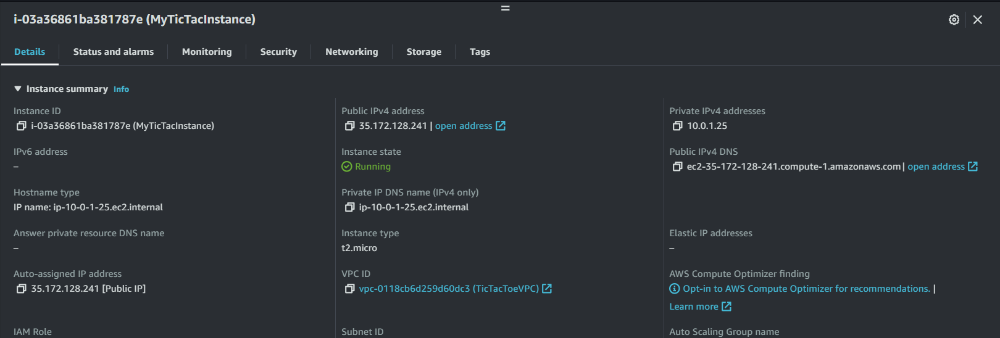

# Mateusz Luberda

- Course: Cloud programming
- Group: PN 9:15
- Date: 27.05.2024

## Environment architecture

VPC działające jako izolowana prywatna sieć dla infrastruktury.
Instancja EC2 stworzona za pomocą Terraform w podsieci VPC.
Docker containers uruchomione za pomocą 'docker compose up' na instancji EC2 hostowały grę.
Security groups skonfigurowane tak, aby umożliwić otworzenie adresu w przeglądarce internetowej.
User pool w AWS Cognito, która przechowuje i zarządza informacjami o uzytkownikach. Skonfigurowana tak, aby weryfikować użytkowników za pomocą maila oraz egzekwować silną politykę haseł.

## Preview

Screenshots of configured AWS services. Screenshots of your application running.

EC2

Kółko i krzyżyk

Cognito

Congig.js

## Reflections
Do wykonania zadania wykorzystałem plik main.tf z zadania A5, który tworzy nową instancję EC2. Po jego skopiowaniu, zostało tylko dołączyć autentyfikację z użyciem usługi Cognito. Najpierw skorzystałem z tutoriala przygotowanego przez AWS pokazującego jak wyklikać dodanie Cognito do aplikacji w React'ie. Dodanie funkcjonalności autentyfikacji bez terraforma nie przysporzyło żadnych problemów, udało się za pierwszym razem. Naspeine skopiowałem kod z zadania A5 i starałem się przenieść wyklikaną konfigurację Cognito na kod terraforma. Z pomocą kilku tutorialów z YouTube'a udało się to bezproblemowo, więc nie jestem w stanie rozpisać się na temat pokonanych przeszkód, gdyż wszystko udało sie za pierwszym razem. Nauczyłem się stawiać bezpieczną aplikację z pomocą usług AWS, tworzyć user pool, czy przesyłać tokeny do .
